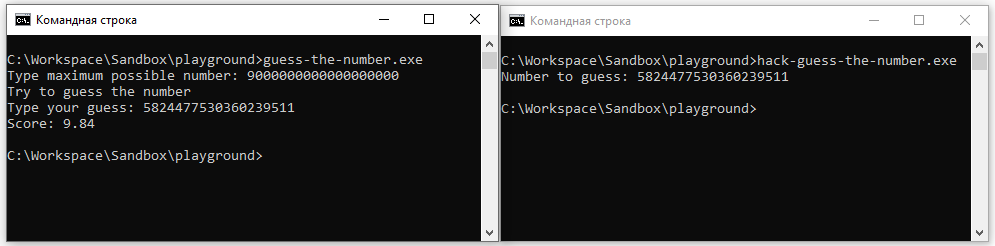

# Hack for [Guess the number](../../games/guess-the-number)

Current status: **OK**

## Description (How to use)
1. Start `guess-the-number` game and type in maximum number.
2. Start `hack-guess-the-number` in console. It will print you the number to be guessed in `guess-the-number`.

### How to pass the challenge ([Read the process memory](../../challenges/read-process-memory.md)).
1. Start `guess-the-number` game and type in maximum number `9000000000000000000`.
2. Start `hack-guess-the-number` in console. Copy the number it printed.
3. Paste the number in `guess-the-number` game. Obtain score of `9.8`.

#### Screenshot


## Compilation
```
make
```

## Clean-up
```
make clean
```

## Requirements
You need `make` and `g++` to compile this hack.
