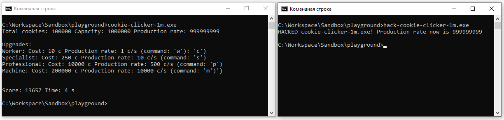

# Hack for [Cookie Clicker 1M](../../games/cookie-clicker-1m)

Current status: **OK**

## Description (How to use)
1. Start `cookie-clicker-1m` game.
2. Start `hack-cookie-clicker-1m`. It will automatically change `production rate` to `999999999`.

### How to pass the challenge ([Change memory of another process](../../challenges/write-process-memory.md)).
1. Start `cookie-clicker-1m` game.
2. Start `hack-cookie-clicker-1m`. It will print `HACKED cookie-clicker-1m.exe! Production rate now is 999999999` and shutdown.
3. Return to `cookie-clicker-1m` and type `c` until you won. These actions can be easily done in less than a minute so you will obtain score of more than `1000`.

#### Screenshot


## Compilation
```
make
```

## Clean-up
```
make clean
```

## Requirements
You need `make` and `g++` to compile this hack.
